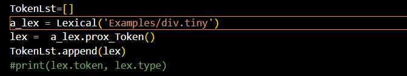
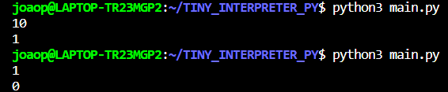

# INTERPRETADOR LINGUEGEM TINY
### Autor: João Pedro Freitas de Paula Dias

## LINGUAGEM TINY
* Programa interpretado
* Todo programa deve começar com a palavra reservada
program seguida de um ou mais comandos
* Pode-se combinar vários comandos, onde comandos são
de atribuição, laço, condicionais e saída
* Identificadores começam com uma letra ou _, seguido de
zero ou mais letras, dígitos ou _
* Armazenam apenas valores inteiros com escopo global
* Constantes (literais) são números inteiros
* Expressões aritméticas ou lógicas são feitas sobre
constantes, identificadores e leitura
* Comentários de uma linha após o símbolo #

## TRABALHO REALIZADO

Este trabalho tem como objetivo criar um interpretador para a linguagem ```Tiny```, para isso foi utilizada da linguagem python para a realização do projeto, devido a sua facilidade de implementação. Podemos dividir o código em 2 partes principais, a análise lexica e a análise sintática; Para a análise léxica o principal objetivo é extrair os Tokens que estão contidos no programa em Tiny; Já a sintática conta com a tarefa de interpretar os tokens e decidir quais serão os comando a serem executados.

## Exemplo de Execução

Para a execução do projeto é necessário especificar o programa em tiny que será interpretado, isso pode ser feito no arquivo ```main.py``` na linha 7, logo após, apenas execute o comando: ```python3 main.py```.

</br>

Executando o Arquivo ```if.tiny```, onde se o numero for menor que 10 é mostrado 0 na tela, caso contrário 1: 

</br>


## REFERÊNCIAS

[1] RIMSA, ANDREI - Repositório GitHub, @rimsa: tiny - Disponível em: https://github.com/rimsa/tiny. Acessado em 14 de Outubro de 2023.

[2] ASCANIO, DIEGO - Repositório GitHub, @DiegoAscanio: interpretador tiny incompleto - Disponível em: https://github.com/DiegoAscanio/interpretador-tiny-incompleto. Acessado em 11 de Outubro de 2023.

[3] ASCANIO, DIEGO - Repositório GitHub, @DiegoAscanio: analizador lexico exemplo - Disponível em: https://github.com/DiegoAscanio/analisador-lexico-exemplo. Acessado em 10 de Outubro de 2023.